Contents
================================================================================

********************************************************************************

**After reading through this, you should have a working understanding of what version control is and why it is useful. You should also be able to start using version control in your own work through [GitHub](http://github.com) and [GitHub Desktop](http://gitkraken.com) .**

********************************************************************************

- [Introduction: What is version control?](#what_is_vc)
- [Getting started with GitHub](#todo)
- [Installing GitHub Desktop and Tutorial](#GH_install)
- [GitHub Interface & Command Line Interface (CLI)](#GK_CLI)
- [Initialising and using a git repository](#step1)
- [Some additional points](#additional)
- [Additional resources](#whatelse)

********************************************************************************

<a name="what_is_vc">Introduction: What is version control?</a>
================================================================================

[Version control](https://en.wikipedia.org/wiki/Version_control) is any system that records changes made within a set of files over time so that different versions of files can be managed and, if necessary, recovered. **Put more intuitively**, version control is a way of taking a snapshot in time (called a 'commit') of all the files in one of your folders (called 'repositories'); as you make changes to the files within your folder, you can always come back to previous snapshots that you've taken (if, e.g., you make a change that you regret, or need information from a previous point in time). You can even have multiple different versions of the same folder existing in parallel (called branches). You can think of it as an extra step on top of 'saving' a file -- a step that solidifies a key point in time for your work, records how it changed from previous and subsequent points in time, and records who made the change, when, and why.

Version control is indispensable for large coding projects with multiple developers collaborating on the same code, but it's also a very useful tool for the workflow of scientific research. Using version control can allow you to better manage data files, analysis files (e.g., R code), manuscript files, and more in a way that keep things clean and removes the anxiety of losing track of which file is the 'right' one. 

Version control is also an excellent tool for doing open science. By keeping a record of how your data, analysis, and manuscripts change over time, the process of doing science becomes more transparent. By uploading your progress to [GitHub](http://github.com), you can make the whole process of doing science accessible to others, and have evidence of priority and accuracy in your conclusions (you can also keep repositories private). 

<br>


```{r, echo = FALSE, fig.alt = "GitHub interface with summary of a project's commit history.", fig.cap = "*An example of the timeline of commits for a recent project. Bold titles on top show more recent changes committed to the repository; the bold messages are written at the time of committing, and make it easier to see important changes added over time. In GitHub, you can click on these bold titles to see what changes were made since the last commit; from here, you can also see the whole repository as it was during the time of commit (you can also do this by clickling on the `< >` buttons on the right).*", out.width="100%"}
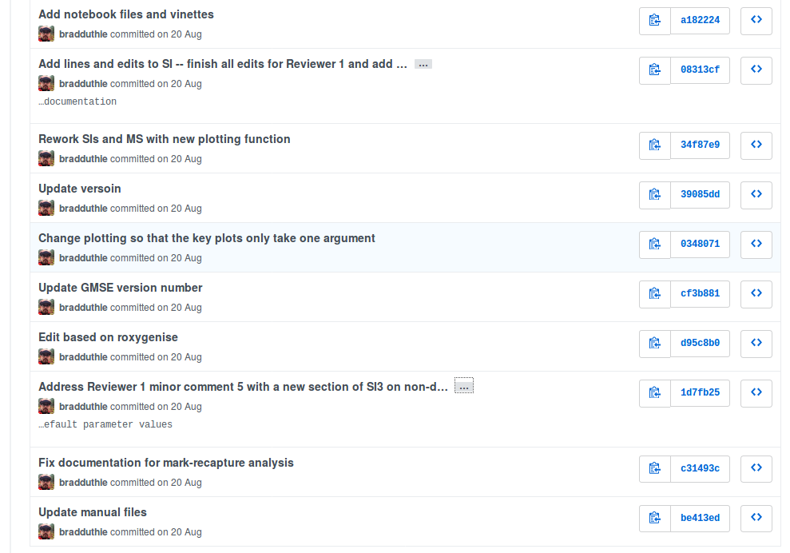
```


<br> 

There are many different [types of version control](https://en.wikipedia.org/wiki/List_of_version_control_software) available. Here, I am going to focus only on [git](https://git-scm.com/) version control software, which has the advantage of being free, open source, available on all platforms (Linux, Mac, and Windows), and the most popular software among research scientists. The software was invented by [Linus Torvalds](https://en.wikipedia.org/wiki/Linus_Torvalds), the same developer who created the [Linux kernel](https://en.wikipedia.org/wiki/Linux_kernel).

In this introduction to using version control, I am going to focus heavily on using two software tools that work with [git](https://git-scm.com/), [GitHub](http://github.com) and [GitHub Desktop](https://desktop.github.com/). Like git, both [GitHub](http://github.com) and [GitHub Desktop](https://desktop.github.com/) are free for basic use, though more advanced options can come with a small cost. These two tools make using git much easier, especially if you don't like the idea of working within the command line. [GitHub](http://github.com) offers a massive online platform where you can store your git repositories, discover and download new repositories, and collaborate with other GitHub users (e.g., in organisations such as the [Stirling Coding Club](https://github.com/StirlingCodingClub)). [GitHub Desktop](https://desktop.github.com/) provides a nice graphical user interface for using git, visualising your repository, and linking to GitHub. As you become proficient with git, you might find yourself start thinking less in terms of individual files and file versions, and more in terms of commits and branches with inter-related files.

First, I am going to briefly talk about how to use git entirely *within* GitHub on your browser. This requires fewer steps than using [GitHub Desktop](https://desktop.github.com/), but it can only get you so far because you cannot work with the changes that you make directly on GitHub. For example, if you edit an R file in GitHub, you would have no way to run the code without pulling the file from GitHub to your local repository.


<a name="todo">Getting started with GitHub</a>
================================================================================

If you are just starting out with git, I recommend [signing up with a GitHub account](github.com/join), then [downloading GitHub Desktop](https://desktop.github.com/). You can do everything that I explain below with only these two tools. For those who prefer to use the command line interface, I have included instructions for how to do this below too. Learning to use git in the command line is probably useful if you already use the command line in your normal work flow (or if you are interested in doing so!), but if it's not something that you work with already, learning it here is probably more trouble than it's worth.


<a name="Desktop">Downloading the GitHub Desktop</a>
================================================================================

Once you have a GitHub account, you can [download GitHub Desktop](https://desktop.github.com/). This is not technically necessary to do to use git and GitHub. The desktop application only works with Windows and Mac (which is part of the reason I use the command line and am including the CLI instructions here). You can find [the link](https://desktop.github.com/) ([https://desktop.github.com/](https://desktop.github.com/)) by scrolling down your home screen on GitHub. [The link](https://desktop.github.com/) will take you to the page below.

```{r, echo = FALSE, fig.alt = "Screenshot of the webpage for GitHub Desktop download", fig.cap = "*The GitHub Desktop download website.*", out.width="100%"}
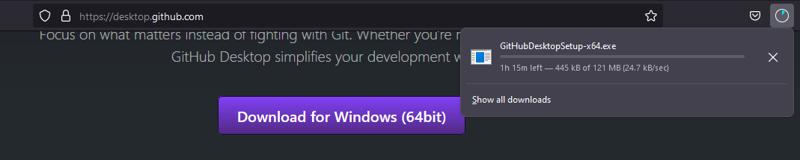
```


After GitHub Desktop has downloaded, you should be able to find the downloaded file in your downloads folder.

```{r, echo = FALSE, fig.alt = "Downloaded GitHub desktop icon shown with description", fig.cap = "*The downloaded executable file should show up with an icon in your download folder.*", out.width="60%"}
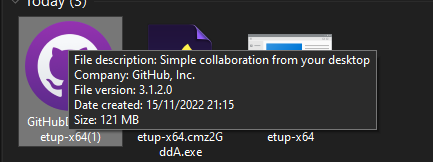
```

Double click on the downloaded file, then GitHub should install.

```{r, echo = FALSE, fig.alt = "Cartoon image of outerspace, which says that GitHub Desktop is being installed.", fig.cap = "*GitHub Desktop is being installed.*", out.width="60%"}
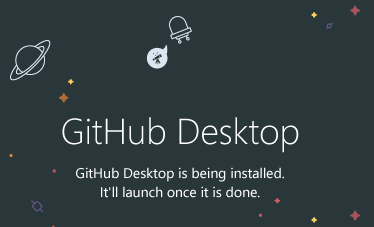
```

Once GitHub is installed, you should sign into your GitHub account. It is important to do this to link your GitHub account with the GitHub Desktop.

```{r, echo = FALSE, fig.alt = "Imagine showing a Welcome message for GitHub Desktop, with an option to sign into GitHub.", fig.cap = "*Welcome to GitHub Desktop.*", out.width="80%"}

```


You will be asked to authorise the desktop application to access GitHub. Again, this is important to do so that you can link your GitHub account with GitHub desktop. Once you do this, you can configure your GitHub account. Here is mine below.

```{r, echo = FALSE, fig.alt = "Form for configuring GitHub with fields for name and email, and a decorative space theme cartoon to the right.", fig.cap = "*Make sure to configure your GitHub Desktop.*", out.width="80%"}
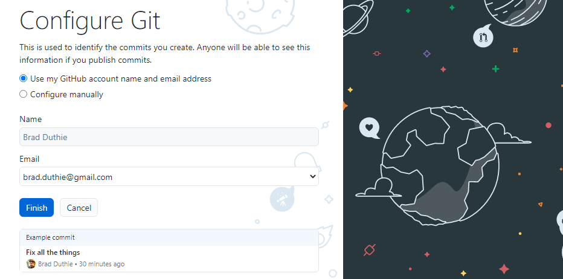
```


That should be it! You should now have your GitHub Desktop linked with your GitHub account online. The tricky part is getting started and getting into a rhythm of using git and GitHub. The tutorial is a good place to start, although I think that it complicates things a bit unnecessarily by introducing the concept of branching very early on. Nevertheless, I still recommend first going through the (brief) tutorial as a starting point.

```{r, echo = FALSE, fig.alt = "Blue button that says 'Create a tutorial repository....'", fig.cap = "*Start out with a tutorial repository.*", out.width="50%"}

```


The tutorial will create a new repository (i.e., a folder) on your computer (probably in 'Documents/GitHub'). This repository has another (hidden) folder within it that holds all of the information on the history of the repository. It is also initialised with a file called 'README.md', which you can open with any text editor (e.g., Rstudio). The interface of the GitHub Desktop is shown below.

```{r, echo = FALSE, fig.alt = "GitHub Desktop interface is shown with a toolbar and panels for file changes, commit messages, tutorial outline, and a welcome message.", fig.cap = "*Welcome to the tutorial for GitHub Desktop*", out.width="100%"}
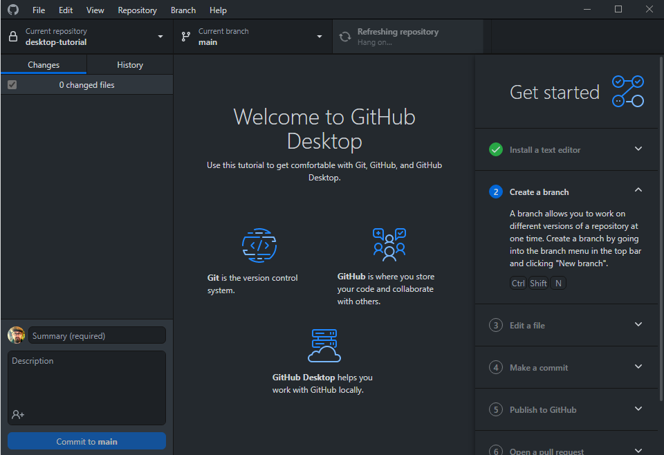
```

The first task that the tutorial will have you complete is making a new branch. Go ahead and do this, but it is actually not strictly necessary. There is nothing wrong with just working off of the main branch, and we will get to what branches are later (for getting started, and for a lot of lone work, they can actually kind of be ignored). The rhythm that you really need to get comfortable with is editing files, committing them, then passing them to GitHub. The next task that the tutorial has you do is edit a file by adding a new line to the file 'README.md'. You can do this in Rstudio, or any text editing software (e.g., notepad or gedit, but not a Word Processor such as MS Word or LibreOffice).

```{r, echo = FALSE, fig.alt = "Text document open with various lines explaining a README file. The seventh line reads 'Adding a new line!'", fig.cap = "*Add a new line to the README.md file in the GitHub Desktop tutorial*", out.width="60%"}
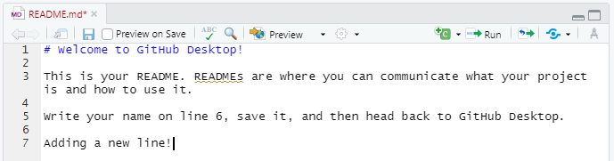
```

Save the README.md file after changing it somehow. When you go back to GitHub Desktop, you will then see the file again, but with the lines that you just added highlighted in green (lines removed would show up in red). 

```{r, echo = FALSE, fig.alt = "GitHub Desktop interface shows a 'README.md' file open with two new line additions highlighted in green. A commit message is shown in the lower left.", fig.cap = "*A new change is shown in the GitHub Desktop, with the option for making a new commit.*", out.width="100%"}
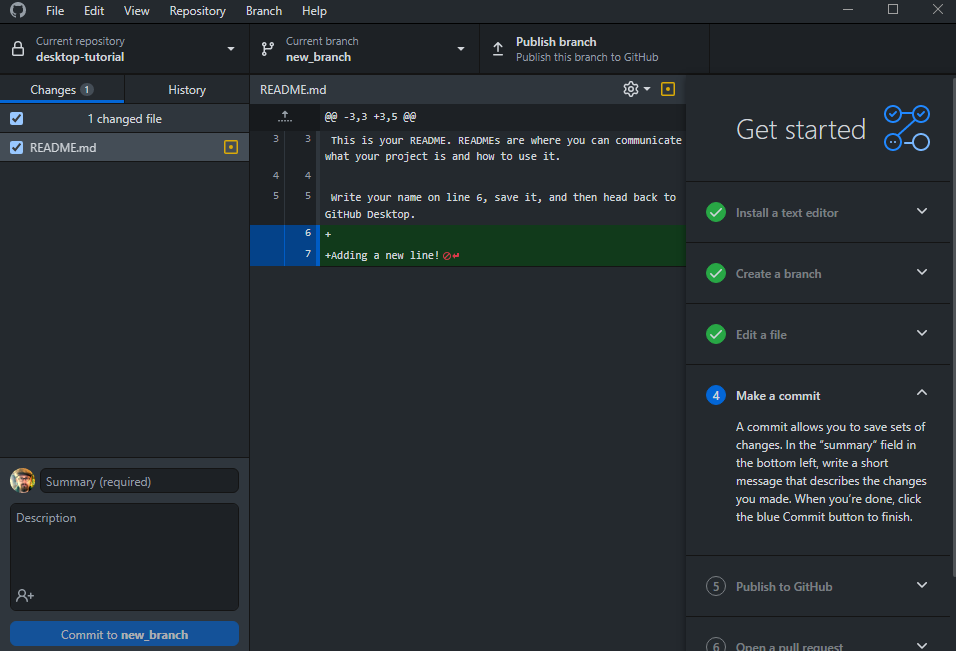
```

What git is doing here is comparing the current state of the file to the most recent committed version of it (i.e., the original initialised version, in this case). This can be very useful for reminding yourself what you have saved since your last commit, and you can see this comparison on the GitHub website too for the entire history of your repository. In other words, at every commit, it is possible to view what has changed from the previous commit. Note that this is only true for plain text files (e.g., files with extensions of R, Rmd, TXT, CSV, MD), not binary files that cannot be viewed as plain text (e.g., DOCX, XLSX, or any image files). 

Note in the lower left of the figure above that we have the option to create a new commit. This option is always available when some file that is being tracked in the repository has changed. It is good practice to commit changes regularly, which makes it easier to see the history of a repository and backtrack to any place in its development. It is also good practice to commit with an informative message, so that when you or someone else scrolls through the commit history, it is clear what changes have been made with each new commit. 

Once we have committed the change to our new branch, we need to *push* it to GitHub (we can also *pull* from GitHub, but we will worry about this later). The tutorial will show you how to do this, then show you how to make a pull request and merge the changes from your new branch into the main branch. This will be easy to do because we have not changed the main branch at all, so there will not be any conflicting changes when merging. When there are conflicting changes (e.g., suppose you made changes to the main branch, then made *different* changes to your new branch and tried to merge the two), you will get a merge conflict. This is not a cause for concern; it just means that you need to figure out which changes should apply to the merge.


<a name="GK_CLI">GitHub Desktop</a>
================================================================================

Now that you have completed the tutorial, here is how I recommend that you start using git and GitHub in your day-to-day work. If you have heard about branches and merges, you can just forget about them for now. Just focus your workflow on saving, committing, and pushing. This will create a clear history of your project repository that is saved on your computer and on GitHub, and you can always rewind back to a previous version. 

Throughout this section, I will explain how to use the basic functions of git and link git with GitHub using [GitHub Desktop](https://desktop.github.com/).  Note that GitHub Desktop can run alongside whatever text editor (e.g., Rstudio) you're using to actually edit your text files, but you do not typically make edits from within GitHub Desktop itself -- GitHub Desktop is more like a file manager in this way; you can keep it open to commit and push while working on files in your git repository.

<a name="step1">Initialising and using a git repository</a>
================================================================================

Initialise a git repository in the [GitHub Desktop](https://desktop.github.com/) by navigating to File and choosing 'New repository...' from the pulldown menu. You can do this every time you want to start a new project file, and I recommend that you keep all of the files relevant to a specific project (e.g., a thesis chapter) in the same repository (i.e., data, R scripts, writing). 

```{r, echo = FALSE, fig.alt = "GitHub Desktop interface File pulldown selecting 'New repository...'", fig.cap = "*Create a new repository in the GitHub desktop.*", out.width="50%"}
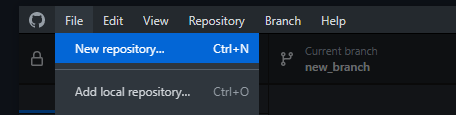
```

Make sure to name the project something descriptive and choose a path on your computer where the repository will be held. Where you choose to put your repositories will depend on your preferences for file organisation, but I prefer to have a folder called 'projects' on my computer that has all of my repositories for scientific projects. Again, I recommend organising your computer folders by project, not saving different project components such as data, analyses, and writing all in different places (this will get confusing when you have multiple projects, I promise!).

```{r, echo = FALSE, fig.alt = "GitHub Desktop interface for creating a new repository with a specific name and path", fig.cap = "*Create a new repository in the GitHub desktop with an informative name and memorable location ('Local path').*", out.width="80%"}
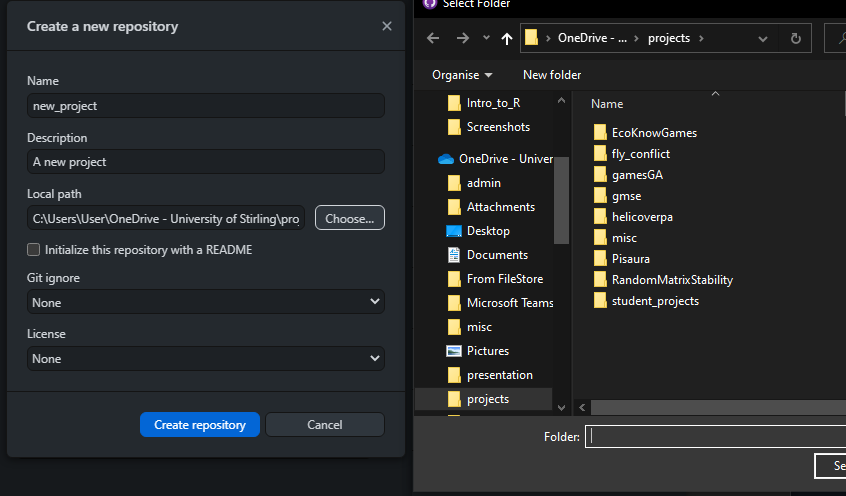
```

Once you have created your new repository, immediately publish the repository to GitHub to link between your computer and GitHub. 

```{r, echo = FALSE, fig.alt = "Blue button for publishing a repository to GitHub", fig.cap = "*Publish your repository to GitHub as soon as you can.*", out.width="80%"}
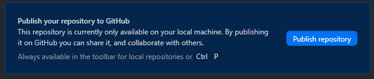
```

Now you are ready to go. Every time you make some substantial changes to files in your repository, use the GitHub Desktop to commit the changes to the main branch, then push them to your repository on GitHub. This will seem like an extra unnecessary step as you work, at first, but I promise you that it will, at some point, save you a lot of time and frustration. The common wisdom in using version control is **"commit early, commit often"**, meaning that it is generally better to err on the side of commiting changes that you make to your repository more often than you think is necessary. In practice, I try to commit frequently, almost as often as I save file changes; even small changes can be useful to have their own commit because the changes are easier to read in small chunks rather than massive changes to files.

You will also find that your mindset for working will change a bit; the entire history of your project will be recoverable, so you can be a bit more bold with trying new things and making changes. To get a sense for what all of this looks like, please feel free to look through the [commit history](https://github.com/bradduthie/resevol/commits/master) of some of my projects (and feel free to ask questions). 

<a name="additional">Some additional points</a>
================================================================================

Remember that you can see the changes made to plain text files (e.g., files with extensions of R, Rmd, TXT, CSV, MD), not binary files (e.g., DOCX, XLSX, or any image files). This does not mean that you cannot commit and push changes to binary files using git; you absolutely can and should! 

```{r, echo = FALSE, fig.alt = "Word processor shown with the introduction to a cover letter to the journal Scientific Reports.", fig.cap = "*Binary files still work with git, but you cannot see line by line changes.*", out.width="80%"}
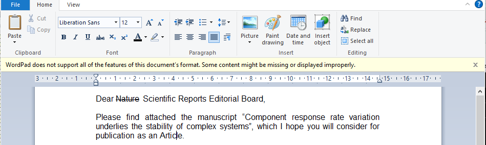
```

But if you make a change to a binary file, such as the cover letter written in a word processor above, then git will not be able to show you line by line changes. You will just get a short message in the GitHub desktop.

```{r, echo = FALSE, fig.alt = "Box stating 'This binary file has changed'.", fig.cap = "*Binary files changes are not shown in GitHub Desktop.*", out.width="40%"}
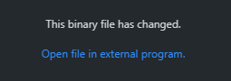
```


There is a lot more to consider. These notes are an abridged and updated version of a longer set of [notes on version control](https://bradduthie.github.io/version_control/vc_notes.html) that I wrote for a previous IAPETUS workshop and [Stirling Coding Club](https://stirlingcodingclub.github.io/studyGroup/) session. The [longer version](https://bradduthie.github.io/version_control/vc_notes.html)] explains some additional features of git, including pulling, branching, and merging (including dealing with merge conflicts). Please feel free to check these out. There will be another special session on version control as part of [Stirling Coding Club](https://stirlingcodingclub.github.io/studyGroup/) on 11 January 2023 over [MS Teams](https://teams.microsoft.com/l/meetup-join/19%3a65d904599e4a469eb0c25199bc98ed1e%40thread.tacv2/1660901322191?context=%7b%22Tid%22%3a%224e8d09f7-cc79-4ccb-9149-a4238dd17422%22%2c%22Oid%22%3a%2291f2dfe8-4ab1-472c-bdc2-755eae2f61cc%22%7d) (all are welcome). The [longer notes](https://bradduthie.github.io/version_control/vc_notes.html) also use the command line interface instead of GitHub Desktop, and also a program called [GitKraken](https://www.gitkraken.com/), which used to be free, but now costs 5.00 GBP per month after a 7-day trial. 

As you get more comfortable with git, you can start exploring new features such as branching, which allows you to create new offsets of your main branch and make changes without disturbing it. This is extremely useful if you have some code that is working, or a draft of a manuscript that you really like, but you want to try something new without being afraid of breaking what you already have. Using GitHub, you can also code collaborative, so you and your colleague might work on different parts of a repository on different branches, then merge your work later on down the line. In my own projects, I usually have somewhere between 2-5 branches at a time, including one main branch that I know is stable, a dev branch that is ready for publication with just a bit more review, a branch that I actually make changes on, and multiple experimental branches in which I am trying new things.

I strongly encourage you to try this simple workflow of saving, committing, and pushing for a while. You will not break anything! If you have questions, get stuck, or start getting nervous, you are welcome to get in touch with me by email (alexander.duthie@stir.ac.uk), by MS Teams, or on GitHub (https://github.com/bradduthie). Note that you can invite people into your repositories on GitHub and tag them as you would with other social media (e.g., @bradduthie). You can even [comment directly on lines](https://github.com/StirlingCodingClub/version_control/commit/624e53d773bd5ce580b07231c561359e3df4a526#diff-6e5f3475dbeaf9037a12d6a51d8f67042b0f077df8b02320faa8750f39fdd539L5) of code in GitHub. 


<a name="whatelse">Additional resources</a>
================================================================================


**Introductions to version control (guides)**

- [Introduction to Version Control](https://bradduthie.github.io/version_control/vc_notes.html) with CLI and GitKraken
- [British Ecological Society: A guide to reproducible code in ecology and evolution](https://www.britishecologicalsociety.org/wp-content/uploads/2017/12/guide-to-reproducible-code.pdf)
- [An introduction to version control](http://guides.beanstalkapp.com/version-control/intro-to-version-control.html)

**Introductions to version control (videos)**

- [Git and GitHub for Poets: Intro](https://www.youtube.com/watch?v=BCQHnlnPusY) (no programming knowledge needed)
- [Git and GitHub for Poets: Branches](https://www.youtube.com/watch?v=oPpnCh7InLY)
- [Git and GitHub for Poets: Fork and Pull](https://www.youtube.com/watch?v=_NrSWLQsDL4)


