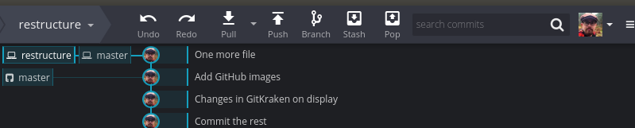
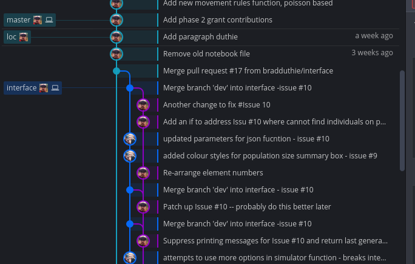
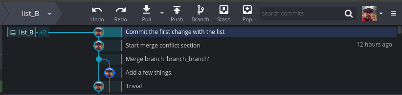
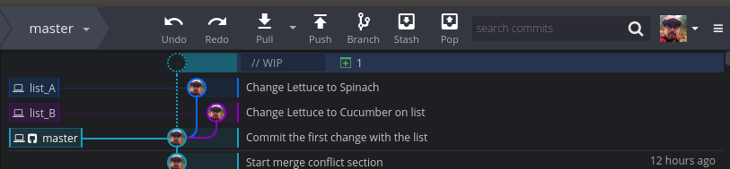
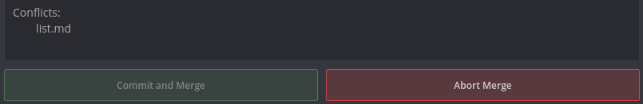
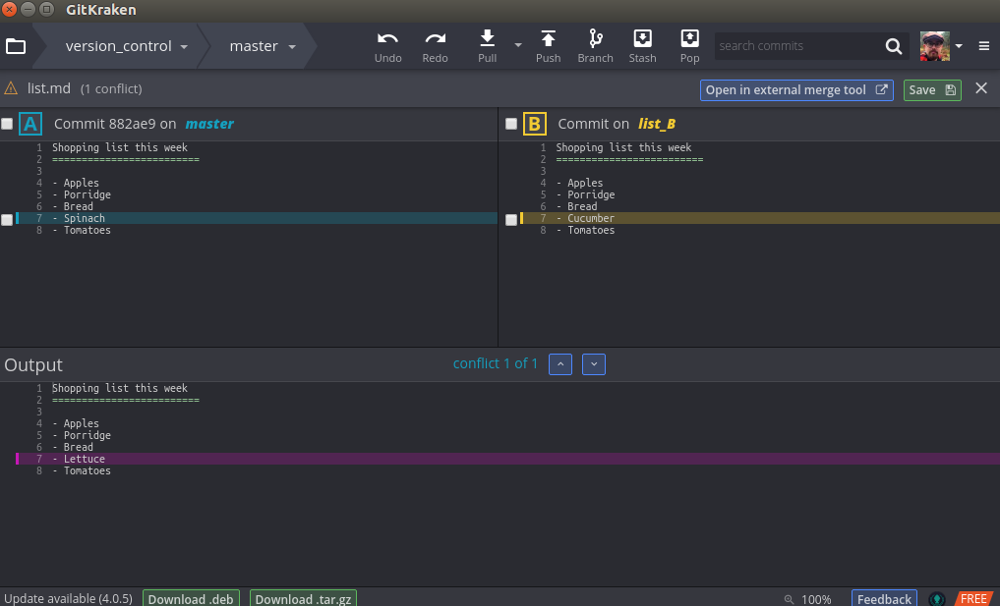
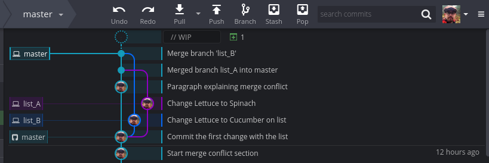
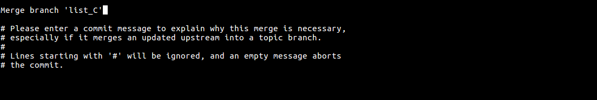
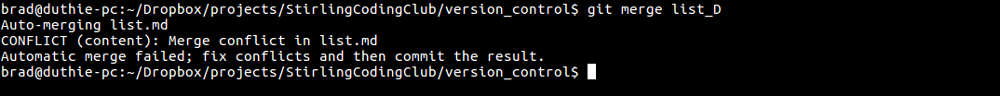

<!---

1. Initialise a new repository in StirlingCodingClub for how to understand and use git
2. Write up an Rmarkdown document introducing version control and how to get started with it in the command line and with GitKraken (would try to do by this WED).
3. As part of the Rmarkdown document, include a diverse list of outside links where people can go to get more help.
4. Post the slides early so that people know what to expect, give the opportunity for people to ask questions before arriving.
5. On 3 OCT, go through the slides, then demonstrate how to use git on the command line and GitKraken, allowing others to follow along.
6. Leave the repository up and address questions as issues when they arise.

--->

Introduction
================================================================================

- [git](https://git-scm.com/): A software for version control
- [GitHub](http://github.com): A website that enables collaboration and use of git
- [repository (repo)](): A folder that is using git

1. What is version control? {.what_is_vc}
================================================================================

[Version control](https://en.wikipedia.org/wiki/Version_control) is any system that records changes made within a repository over time so that different versions of files can be managed and, if necessary, recovered.


2. Why use version control? {.why_is_vc}
================================================================================

- Keep track of files that are edited by multiple collaborators simultaneously
- Easy way to undo changes to any point in the past
- Back up the entire history of a project

3. What is git? {.what_is_git}
================================================================================

- Open-source version control developed by Linus Torvalds
- Not an acronym for anything
- Not the same thing as [GitHub](http://github.com), which is a repository for git


4. How does version control work? {.how_does_vc}
================================================================================


5. How to use git in GitHub {.how_use_gh}
================================================================================


6. Using GitKraken & Command Line Interface (CLI)
================================================================================

This set of instructions will get you started working with git and GitHub. Throughout this guide, I will explain how to use the basic functions of git and link git with GitHub using both the free software [GitKraken](http://gitkraken.com) and the command line interface. **You do not need to know both GitKraken and the command line to use git**. One method for using git is sufficient, and unless you are already familiar with the command line, or wish to make it a part of your work flow, then I recommend using GitKraken to start off with git (i.e., feel free to ignore all of the command line instructions that follow).

Step 1: Initialising a git repository
--------------------------------------------------------------------------------

Initialise a git repository using [GitKraken](http://gitkraken.com) by specifying the folder on your computer where you want the repository to be initialised by selecting the 'Init' tab (far left) and the 'Local' tab (top left) within GitKraken. If you cannot figure out how to get the the image below, go to the upper left folder icon within GitKraken.


<br>

In the command line, this is done by first going to the folder where you want to initialise the repository.

```{bash, eval = FALSE}
brad@duthie-pc:~$ cd Dropbox/projects/StirlingCodingClub/version_control
```

Next, [initialise](https://www.youtube.com/watch?v=9p2d-CuVlgc) the git repository with `git init`.

```{bash, eval = FALSE}
brad@duthie-pc:~/Dropbox/projects/StirlingCodingClub/version_control$ git init
Initialised empty Git repository in /home/brad/Dropbox/projects/StirlingCodingClub/version_control/.git/
```

You now have a local repository initialised and are ready to start using git. Note that the repository is not yet linked with GitHub, but you can still view the repository within [GitKraken](http://gitkraken.com). The image below shows the version_control repository during an early stage of development (but several commits after initialisation). Each of the four cyan circles shows an individual commit with a message about what the commit is doing. I can go back to see what the directory looked like in a previous commit by clicking one of these circles.


<br>

Note that the bottom area of the GitKraken interface shows the changes made during the last commit. You can also see the status of the git repository using the command line `git status`, which returns something like the below.

```{bash, eval = FALSE}
brad@duthie-pc:~/Dropbox/projects/StirlingCodingClub/version_control$ git status
On branch master

Initial commit

Untracked files:
  (use "git add <file>..." to include in what will be committed)

	git_cheat_sheet.pdf
	vc_notes.Rmd
	vc_notes.html

nothing added to commit but untracked files present (use "git add" to track)
```

The command `git log` returns a list of previous git commits (equivalent to the cyan circles in the GitKraken interface shown above). I will explain this more later, but first let's link the newly created git repository with GitHub.


Step 2: Linking your repository with GitHub {.ghlink}
--------------------------------------------------------------------------------

To link GitKraken with your GitHub account, first go to GitHub and login. Next find and click the button that looks like the one below.


<br>

This will take you to the page that allows you to set up a new repository. **Be sure to use the same repository name on GitHub that you do on your local computer**, and avoid the use of spaces.


<br>

After you click the green button 'Create repository', GitHub will take you to a place that gives you a URL for a quick setup. The URL for the version_control repository that I just set up is below.


<br>

Copy that URL, then go back to GitKraken. Look at the left-hand side of the interface which has names that include 'Local', 'Remote', 'Pull Requests', etc. Hover over the 'Remote' tab and a green '+' should appear for you to click. This will open a box like the one below with the options 'URL', 'GitHub.com', and 'Bitbucket.org'.


<br>

Confusingly, you do not want to select the 'GitHub.com' tab. Select the URL tab instead; type in the repository name (the name on GitHub should be the same as the folder name on your computer), then paste the copied URL above into the 'Pull URL' field. The 'Push URL' field should be identical to the 'Pull URL' field. After you click the green 'Add Remote' button, you should be able to go back to the GitKraken interface and click the 'Push' button.


<br>

After you click 'Push', you will be asked what branch to push and pull from. Keep 'master' for now and just click 'Submit'.


<br>

Now if you go back to GitHub, you should see any files you had in your repository appear. 

If you want to link your local repository with GitHub using the command line instead of GitKraken, then after creating a new repository on GitHub, use the command below.

```{bash, eval = FALSE}
brad@duthie-pc:~/Dropbox/projects/StirlingCodingClub/version_control$ git remote add origin https://github.com/bradduthie/version_control.git
```

You can then push all of your files to the GitHub repository with the command below.

```{bash, eval = FALSE}
brad@duthie-pc:~/Dropbox/projects/StirlingCodingClub/version_control$ git push -u origin master
```

You should now have a git repository up and running on your local machine, and a linked version on GitHub. Next I will explain how to add and commit changes to files.

Step 3: Add and commit files
--------------------------------------------------------------------------------

Now that you have a repository ready to start tracking your changes, you can start making commits. The flow of this process as you work within your repository is typically (1) saving files, (2) adding (or 'staging') files , (3) committing files, and (4) pushing files too GitHub. Rather than saving the most recent changes that you've made to the files in your repository, the idea here is to save a snapshot of the whole repository using 'commit'. You can then always return to this commit to view what your repository looked like at a previous time. 


<br>

In the above image, the history of commits is shown with in the cyan circles, along with a commit message written to explain the changes made in each commit (by convention, these are typically written in the present tense). So you can see that my most recent commits were to 'Add first image', and before that to 'Add some video links', etc. You can see what the directory looked like at these points by clicking on these commits (this is also possible in GitHub where you can see the [history of this repository](https://github.com/bradduthie/version_control/commits/master)). The very top shows WIP (work in progress), which is the directory as it looks at the moment.

As you work on your files, continue to save things as you normally would; you need to save before files can be added or committed. In the above, you can see the files 'vc_notes.Rmd' and 'vc_notes.html'. These have been saved recently, which is why they are listed as 'Unstaged files' (shown with yellow icons). In the command line, we can see the equivalent of these saved but unstaged files by typing `git status`.

```{bash, eval = FALSE}
brad@brad-ThinkPad-X201:~/Dropbox/projects/StirlingCodingClub/version_control$ git status
On branch master
Your branch is up-to-date with 'version_control/master'.
Changes not staged for commit:
  (use "git add <file>..." to update what will be committed)
  (use "git checkout -- <file>..." to discard changes in working directory)

	modified:   vc_notes.Rmd
	modified:   vc_notes.html

no changes added to commit (use "git add" and/or "git commit -a")
```


In the above, both files are listed as 'modified', but not staged.

Now assume that we want to commit the changes we have saved, establishing a snapshot of the directory that we can return to in the future. The common wisdom in using version control is **"commit early, commit often"**, meaning that it is generally better to err on the side of commiting changes that you make to your repository more often than you think is necessary. In practice, I try to commit frequently, almost as often as I save file changes; even small changes can be useful to have their own commit because the changes are easier to read in small chunks rather than massive changes to files. To commit our changes, we need to 'stage' the files. You can stage all of the changed files at once, if desired, or you can stage only a subset of them (if, e.g., you wanted to record a change in one file, but wait to commit changes in another file). In GitKraken, staging is done simply by hovering over the file of interest in the 'Unstaged files' field, then clicking on the green 'Stage file' box that appears to the right of it. If you instead want to stage all files, then you can click on the 'Stage all changes' box in green.


<br>

In the above screenshot, the 'vc_notes.Rmd' file has been staged, while the the changed file 'vc_notes.html' and image files in the subdirectory 'images' have not been staged. To stage a file in the command line, use the `git add` command. I have staged (or '[added](https://www.youtube.com/watch?v=9p2d-CuVlgc)') the file `vc_notes.Rmd` below. 

```{bash, eval = FALSE}
brad@duthie-pc:~/Dropbox/projects/StirlingCodingClub/version_control$ git add vc_notes.Rmd
```

If you want to add all unstaged files in the directory, you can do so using an asterisk, as below.

```{bash, eval = FALSE}
brad@duthie-pc:~/Dropbox/projects/StirlingCodingClub/version_control$ git add *
```

This is also handy if you want to only add files in a single subdirectory; if, for example, you only wanted to add the images in the image folder.

```{bash, eval = FALSE}
brad@duthie-pc:~/Dropbox/projects/StirlingCodingClub/version_control$ git add images*
```

The asterisk just means 'anything after' whatever you've typed (in this case, anything after 'images'). You can also use it in front of text. If, e.g., you want to only add `Rmd` files, then you could use ``git add *.Rmd`.

Committing the staged file is easy in GitKraken. Simply add a commit message. In the above example, this message is 'Making a commit in Gitkraken', with further (optional) description in the message below. In general, it is a good idea to make commit messages meaningful, so that you can understand the history of changes in a repository and easily refer back to key points in development (e.g., "Add new linear model analysis" or "Make edits to first paragraph of manuscript"). In practice, [it's easy to get lazy](https://xkcd.com/1296/) with this. To finalise the commit in GitKraken, just click the big green 'Commit' button. You will then see another addition to your commit history in the GitKraken interface (another cyan circle added to the chain). In the command line, you can commit as follows.

```{bash, eval = FALSE}
brad@duthie-pc:~/Dropbox/projects/StirlingCodingClub/version_control$ git commit -m "Making a commit in the command line"
```

To see the history of commits at any time in the command line, type `git log`.

One last thing with respect to staging and committing files. One very useful feature of git is the ability to see changes that are made to files from one commit to the next. You can do this in GitKraken simply by clicking the staged, unstaged, or already committed file. What you'll see is a record of the changes that have been made since the previous commit.


<br>

In the above, the red refers to lines that have been removed, while the green shows lines that have been added. Once everything has been pushed to GitHub (see below), we can also see the record of these changes in the exact same way [on the GitHub repository](https://github.com/bradduthie/version_control/commit/31882672c0afe6fc20dab31939b3a5da23ca19dd). To interpret the above, we can see that the GitHub URL has been added to line 24, and a new line 30 talking about 'Version control' has been added. **Note that you can only see changes to text files in this way** (e.g., R, Rmd, TXT, CSV, HTML, MKD). If we try to look at the changes to non-text files (e.g., any image files, DOCX, DOC, PDF), it won't work (i.e., if you can open a file and read it in Rstudio, notepad, or some other text editor, then you'll be able to see changes in git; if you can't open it in one of these programs, you can still stage and commit the files in git, but you won't be able to see changes). 

To see changes of *unstaged* files in the command line, use the command `git diff`.

```{bash, eval = FALSE}
brad@duthie-pc:~/Dropbox/projects/StirlingCodingClub/version_control$ git diff vc_notes.Rmd
```

For already staged files, use the command below.

```{bash, eval = FALSE}
brad@duthie-pc:~/Dropbox/projects/StirlingCodingClub/version_control$ git diff --cached vc_notes.Rmd
```

You are now able to stage and commit files in GitKraken and the command line. This is most of what you'll do with version control, and all that you need to get started. Next, I'll show you how to push your commits to GitHub, and pull changes from GitHub to your local branch. Once you're able to do this, you will have all of the necessary skills for using git and GitHub effectively in your own projects; after that, I'll explain some of the features that make git such an effective tool for collaboration.

Step 4: Pushing and pulling with GitHub
--------------------------------------------------------------------------------

Assuming that you have [linked your local repository with GitHub](#ghlink), uploading the changes that you commit to GitHub (pushing), and downloading changes on GitHub and incorporating them into your local repository (pulling) is easy with GitKraken. You should see a top bar in GitKraken that looks like the below.


<br>

To push all of your commits to your GitHub account online, simply hit the 'Push' button. You might be prompted to specify where to push.


<br>

Make sure that the choice from the pull down (in this case, 'version_control') matches the repository name on GitHub ([see it here](https://github.com/bradduthie/version_control)), and keep the branch 'master' for now. Click on the green 'Submit' button, and you should succcessfully have pushed to GitHub. To see the changes made, you can go to the [commit history](https://github.com/bradduthie/version_control/commits/master) in your GitHub repository.

In the command line, you can push with the following command. Note that you'll be asked to type your GitHub name and password.

```{bash, eval = FALSE}
brad@duthie-pc:~/Dropbox/projects/StirlingCodingClub/version_control$ git push
```

The above will work, and push correctly to your GitHub repository, but git might also complain with something like the below.

```
warning: push.default is unset; its implicit value has changed in
Git 2.0 from 'matching' to 'simple'. To squelch this message
and maintain the traditional behaviour, use:

  git config --global push.default matching

To squelch this message and adopt the new behaviour now, use:

  git config --global push.default simple

When push.default is set to 'matching', git will push local branches
to the remote branches that already exist with the same name.

Since Git 2.0, Git defaults to the more conservative 'simple'
behaviour, which only pushes the current branch to the corresponding
remote branch that 'git pull' uses to update the current branch.

See 'git help config' and search for 'push.default' for further information.
(the 'simple' mode was introduced in Git 1.7.11. Use the similar mode
'current' instead of 'simple' if you sometimes use older versions of Git)
```

You can ignore this, but better practice is to specify the remote (i.e., the URL where the code is stored) and the branch whenever you push. In the case of the below, the remote is 'origin' and the branch is 'master' (more on branches later).

```{bash, eval = FALSE}
brad@duthie-pc:~/Dropbox/projects/StirlingCodingClub/version_control$ git push origin master
```

You now know how to push changes to GitHub using both GitKraken and the command line. Pulling changes from GitHub works in roughly the same way. Say that I am away from my office computer, but have logged into my account on a public computer to [make changes to this Rmd file](https://github.com/bradduthie/version_control/edit/master/vc_notes.Rmd) directly from the browser. I commit these changes in the browswer using the GitHub interface, but now need to bring these changes into my home computer and GitKraken from GitHub. As a reminder, if you ever want to edit a text file within GitHub, select the file in your GitHub repository, then click on the pencil icon to the left of the rubbish bin icon.


<br>

To commit any changes you make, scroll all the way down.


<br>

Click the green button to commit a change.

To pull your change in GitKraken, just click on the 'Pull' icon. Your commits from GitHub should be incorporated automatically, assuming that there is no conflict in merging (more on that later).


<br>

You can pull in the command line using the command below.

```{bash, eval = FALSE}
brad@duthie-pc:~/Dropbox/projects/StirlingCodingClub/version_control$ git pull
```

That's all there is to it. You now have all of the tools that you need to save changes to a project repository, commit them to git, and push to and pull from GitHub. This is all that you need for working independently to safely back up and record all of the changes in a project that you are working on. A good work flow is to save the files that you work on frequently, and keep GitKraken (or a terminal) open in the background. Then, whenever you feel like you have made some important changes to your files (e.g., a new paragraph, some new code that works), commit the change and push it to GitHub. In addition to backing up the history if all of your project development, it is also nice to have a record of your progress over time. If you have any difficulty with these instructions, you can submit a question to the 'version_control' [issues](https://github.com/bradduthie/version_control/issues). Next, I will explain how to use branching in git.

Step 4: Branches in git {.branches}
--------------------------------------------------------------------------------

Creating and merging branches in git is an extremely useful tool in work flow. For large projects, I will typically reserve the 'master' branch as a sort of stable version in which I am confident that everything works as intended, and do all new work on a separate branch, only merging to the master branch when I am satisfied that what I have done is sufficient. Then, if I am unsatisfied, I can just abandon my working branch, or delete it. In GitKraken, branching is easy. Just click the 'Branch' button on the top tool bar.


<br>

GitKraken will then ask you to write a new name for a branch on your timeline. In the case of the below, I have titled the new branch 'restructure'. 




<br>

The new branch 'restructure' starts off in the exact same place as the old 'master' branch did. The files have not changed at all -- branching simply tells git to keep everything in the 'master' branch as is, but start a new branch ('restructure', in this case) to which new commits are recorded (but do not affect the master branch). Hence, any new commits that we make will start a whole new path of commit history.


<br>

The above now shows two branches, with 'restructure' diverging from the main 'master' branch. If you want to go back and look at where you left off with the master branch, you can just double click on 'master' to the left of the commit history. When you do this, your repository will automatically revert back to what it looked like at this point in time. **Don't panic if things change**; if you have added files since starting a new branch, they won't be here when you go back to master, but still exist in the new branch. The way this works behind the scenes is that git stores a hidden folder in your git repository called `.git` (I've told my operating system to show hidden files, so you can see this below). 


<br>

Within this hidden folder, all of the history and branches are stored (**don't delete this**).


Back in GitKraken, you can shift between branches 'master' and 'restructure' as you wish by clicking on them. In the command line, you can start a new branch with the command `git branch branch_name`, so making the branch 'restructure' would be done as below.

```{bash, eval = FALSE}
brad@duthie-pc:~/Dropbox/projects/StirlingCodingClub/version_control$ git branch restructure
```

But this only tells git to create a new branch; it doesn't tell git that we want to move to that branch and start making changes to it instead of 'master'. To move among branches, use the `checkout` command.

```{bash, eval = FALSE}
brad@duthie-pc:~/Dropbox/projects/StirlingCodingClub/version_control$ git checkout restructure
```


For now, I will only make changes to 'restructure', using it as a place to experiment with new changes to the repository. I'll leave 'master' as it is, but it is entirely possible to have multiple branches with changes being made independently on each. For large projects (e.g., [an R package](https://github.com/ConFooBio/gmse/branches) with code, documentation, and a manuscript), I'll typically have a master branch of publication quality (`master`), a development branch where everything appears to be working (`dev`), a branch where revisions are taking place (`rev`), and several temporary branches for experimenting with new writing or code.

After adding some commits to the branch 'restructure', I might be satisfied with the changes to the repository and therefore want to merge the 'restructure' branch back into the 'master' branch. Merging means incorporating the changes made in one branch into another branch; this works seamlessly when the branch being merged into has not changed (i.e., if after creating and committing on the new branch 'restructure', the original 'master' branch remains untouched). Merging gets slightly more tricky if commits have been made to both branches since the time of branching, but more on this in a moment. To merge in GitKraken, make sure that you are on the branch that you want to merge *to* (i.e., the branch where you have *not* made the changes that you are satisfied with, but the one that you want to send them to). This is shown in the top toolbar.


<br>

The top toolbar above shows that I am on the branch 'restructure', so I want to click the down arrow on the 'restructure' pull down and switch to 'master'. Next, find the 'restructure' branch in the commit timeline (rectangle box to the left of the cyan cicles), right click, and select 'merge restructure into master'.  You should now see that the changes have been moved into 'master', and the branches 'master' and 'restructure' are now identical; you can continue to make commits on either branch, or, if there is no longer any need for the 'restructure' branch, it can be deleted by right clicking on it and selecting 'delete restructure' (note, there is nothing special about the branch named 'master'; you could equally well use it as a working branch and merge changes that you like into a branch named 'stable' or 'final', or something similar).

In the command line, merges work using the `merge` command. After committing changes in a branch such as `restructure`, the first step in merging to master is to checkout back into the master branch.

```{bash, eval = FALSE}
brad@duthie-pc:~/Dropbox/projects/StirlingCodingClub/version_control$ git checkout master
```

Next, use the `merge` command and specify the branch you want to merge into master.

```{bash, eval = FALSE}
brad@duthie-pc:~/Dropbox/projects/StirlingCodingClub/version_control$ git merge restructure
```

Now, if you want to delete the 'restructure' branch in the command line, ues the following command.

```{bash, eval = FALSE}
git branch -d restructure
```

This explains everything about branching and merging, which is a very useful tool once you get used to it. It allows you to quickly start new experimental pathways in a project and make big changes without fear of disrupting anything. When you collaborate, if different people are working on different aspects of a project, each can work on a separate branch to be merged later. You can view a tree of branch history on GitHub in the 'insights' then 'networks' tab in a repository (e.g., [in the vegan R package](https://github.com/vegandevs/vegan/network)). If you're working with multiple collaborators who are all pulling from and pushing to GitHub, making commits, and creating and merging branches (or if you're doing all of these things yourself with multiple branches), things can start to look messy (for another example, see the [Rmarkdown repository](https://github.com/rstudio/rmarkdown/network) in Rstudio). In GitKraken, this is what it can look like with only two people and three branches.




<br>

Sometimes, merging between branches can create minor (but never disastrous!) issues that need to be resolved, which I will explain in the next step on dealing with merge conflicts (see below).


Step 5: Dealing with merge conflicts
--------------------------------------------------------------------------------

Generally, git is very good about merging branches. It can recognise when new files have been added to each branch, and should preserve both of them during the merge; it can even recognise when different lines of the same text file have changed on each branch, and preserve these changes in a merged file. Sometimes, however, different branches will attempt to change the same lines of a file. When this happens, merging one branch into another will generate a 'merge conflict'. That is, git cannot determine what the merged line should be because each branch is giving it different information. The first thing to keep in mind if this happens is that [there is no reason to panic](https://www.git-tower.com/learn/git/ebook/en/command-line/advanced-topics/merge-conflicts). You haven't broken anything, and the worst thing that can happen, realistically, is that you have to either undo the merge attempt or revert to your most recent commits on each branch. But usually what happens instead is that git will helpfully show you the problem in the text file (by changing the text file to show you the conflict -- i.e., it writes what each branch wants the line to read as, so you can compare and decide) and you'll be able to figure out what you want the change to actually be. Cleverly, the way to deal with the merge conflict is therefore to change the text in the conflict file and *then* commit the change you've made (i.e., 'fixing' the merge conflict is resolved with a new commit, which then becomes part of your commit history just like any other commit). 

I'll intentionally generate a merge conflict so you can see how this is dealt with in git in GitKraken and the command line. First, I'll initialise a new file called `list.md` (this is an example of a [markdown file](https://en.wikipedia.org/wiki/Markdown), the same kind used for GitHub [README](https://github.com/StirlingCodingClub/studyGroup/blob/gh-pages/README.md) files), which will have the text below (see the file [here](https://github.com/bradduthie/version_control/blob/master/list.md)).

```{md}
Shopping list this week
=========================

- Apples
- Porridge
- Bread
- Lettuce
- Tomatoes
```

I will now make two new branches named 'list_A' and 'list_B'. After creating these branches, each will be identical to the original branch in 'master', but I will edit them differently to generate a merge conflict. First I will create the two branches in GitKraken as explained in the [above section](#branches). This is what it looks like in GitKraken.



<br>

You can see that I am now on the 'list_B' branch from the upper left corner (grey sub-box, not the cyan one), and there are three branches at the very tip of the tree ('list_B', 'list_A', and 'master'). Next, I'm going to make two different changes to the list in branch 'list_A' versus 'list_B'. In the file 'list.md' on branch 'list_A', I will change 'Lettuce' in the list above to 'Spinach', while in the same 'list.md' file on branch 'list_B', I will change 'Lettuce' in the list above to 'Cucumber'. Hence, on two independent branches, I have changed the list in conflicting ways. I then switched back to the master branch to write this paragraph. Here's what GitKraken looks like now.



<br>

You can see the two different branches coming off of the master branch, each with a commit message that explains the change. I will now attempt to merge list_A, then list_B back into the master branch. Merging the branch list_A produces no conflicts; the branch merges fine as normal. But when I then try to merge branch list_B into master, GitKraken warns me that there is a merge conflict. Again, it's worth emphasising that there is no need to panic here; nothing is going to be lost, and GitKraken immediately presents me with the option to abort the merge (note the big red button below).



<br>

Aborting the merge will immediately stop it from happening if you realise that it's not what you wanted. Alternatively, however, you can also take a look at what is causing the conflict, then potentially make a decision about how to resolve it within GitKraken. If I click on the triangle with an exclamation mark on it to the left of the conflict file 'list.md', then the conflicting line(s) is shown; in my case, I know in advance this is a conflict because line seven has the word 'Spinach' on the branch 'master' (after 'list_A' merged with master), while line seven has the word 'Cucumber' on the list_B branch that we're attempting to merge into 'master'. This is shown in the GUI below after clicking the yellow triangle.



<br>

The GitKraken environment therefore shows you, side-by-side, the branch you're merging into (left), the branch you're attempting to merge (right), and the resulting output that will happen when you're done (bottom; note that it currently has reverted back to the old commit with 'Lettus' on line 7). If you prefer one line over the other, you can simply click the left or the right (Spinach or Cucumber), and that choice will be what's placed on line 7 when the merge conflict is resolved (GitKraken also explains this in [a short YouTube video](https://www.youtube.com/watch?v=R1iWJNyRpQE)). The resolution of the merge conflict -- i.e., the changes you make to the file to fix the conflict -- is *itself* a commit, and is treated just like any other commit that you can come back to later. Here's what that looks like in GitKraken, with the 'list_B' branch successfully merged after the conflict has been resolved.



<br>

That's it! Note that merge conflicts might also occur when collaborating with others who are working in the same repository and on the same files. While git is generally good about figuring out where everything should go, if the same line is changed in a different way on a file, a merge conflict will inevitably arise.

**If you don't intend to use the command line, you can skip ahead.** But here I'll show what a merge conflict looks like in the command line interface. I'll create the new branches 'list_C' and 'list_D'.

```{bash, eval = FALSE}
brad@duthie-pc:~/Dropbox/projects/StirlingCodingClub/version_control$ git branch list_C
brad@duthie-pc:~/Dropbox/projects/StirlingCodingClub/version_control$ git branch list_D
```

I'll then checkout 'list_C' and change the word 'Apples' on line 4 of 'list.md' to 'Pears', then add the new file and commit.

```{bash, eval = FALSE}
brad@duthie-pc:~/Dropbox/projects/StirlingCodingClub/version_control$ git checkout list_C
brad@duthie-pc:~/Dropbox/projects/StirlingCodingClub/version_control$ git add list.md
brad@duthie-pc:~/Dropbox/projects/StirlingCodingClub/version_control$ git commit -m "Change Apples to Pears"
```

Next, I'll checkout 'list_D' and change the word 'Apples' on line 4 of 'list.md' to 'Bananas', then add the new file and commit.

```{bash, eval = FALSE}
brad@duthie-pc:~/Dropbox/projects/StirlingCodingClub/version_control$ git checkout list_D
brad@duthie-pc:~/Dropbox/projects/StirlingCodingClub/version_control$ git add list.md
brad@duthie-pc:~/Dropbox/projects/StirlingCodingClub/version_control$ git commit -m "Change Apples to Bananas"
```

Now, I'll checkout the 'master' branch and merge list_C into it; as with the list_A branch above, this will not create a merge conflict.

```{bash, eval = FALSE}
brad@duthie-pc:~/Dropbox/projects/StirlingCodingClub/version_control$ git checkout master
brad@duthie-pc:~/Dropbox/projects/StirlingCodingClub/version_control$ git merge list_C
```

You might be asked to write a commit message explaining the merge.



<br>

Just write down a message (or leave the "Merge branch 'list_C'" as it is at the top) and hit CTRL + X. I will now try to merge the branch list_D into branch master. Rather than the nice interface, the command line gives us a slightly less intuitive result.



<br>

What the command line is telling me here is there is a merge conflict in list.md, and that I need to go fix it and commit the new result. If I decide that I actually want to abort the merge, I can do so using the command below.

```{bash, eval = FALSE}
brad@duthie-pc:~/Dropbox/projects/StirlingCodingClub/version_control$ git reset --merge
```

But if I want to actually resolve the conflict, I need to go into the file with the conflict. The way that git handles merge conflicts behind the scenes is to bracket off what each branch things a line should be in the file itself (GitKraken just interprets this in a more helpful way in the GUI). So the list.md file with a merge conflict now looks like the below.

```{md}
Shopping list this week
=========================

<<<<<<< HEAD
- Pears
=======
- Bananas
>>>>>>> list_D
- Porridge
- Bread
- Lettuce
- Tomatoes
```

Recall that I had changed that top list item from "Apples" to "Pears" on one branch and "Bananas" on another branch, then merged the "Pears" change into 'master', and tried to merge the "Bananas" change into the same line thereafter, generating the conflict. What git is showing me with the `<<<<<<<` and `>>>>>>>` is where the conflict is located, separated by a `=======`. The `<<<<<<< HEAD` shows what the branch being merged into (in this case, 'master' -- and what used to be list_C) thinks the line should be. The `>>>>>>> list_D` shows what the merging branch thinks the line should be. To resolve the conflict, I simply decide what **I** want the line to be; I will change it back to Apples, manually editing the file to look like the below.

```{md}
Shopping list this week
=========================

- Apples
- Porridge
- Bread
- Lettuce
- Tomatoes
```

To resolve the commit, I simply save the change I just made to list.md, then add and commit as normal.


9. Additional resources
================================================================================

**Introductions to version control (guides)**

- [British Ecological Society: A guide to reproducible code in ecology and evolution](https://www.britishecologicalsociety.org/wp-content/uploads/2017/12/guide-to-reproducible-code.pdf)
- [An introduction to version control](http://guides.beanstalkapp.com/version-control/intro-to-version-control.html)

**Introductions to version control (videos)**

- [Git and GitHub for Poets: Intro](https://www.youtube.com/watch?v=BCQHnlnPusY) (no programming knowledge needed)
- [Git and GitHub for Poets: Branches](https://www.youtube.com/watch?v=oPpnCh7InLY)
- [Git and GitHub for Poets: Fork and Pull](https://www.youtube.com/watch?v=_NrSWLQsDL4)


