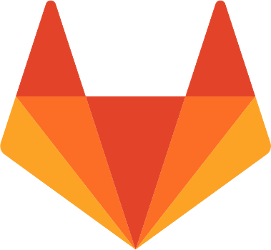

## What version control software does

- Software that records changes you make to files over time
    - Manage different *versions* of files
    - Recover old files, keep track of file changes
    - Collaborate with others on shared files

##  What version control software does

- Software that records changes you make to files over time
    - Manage different *versions* of files
    - Recover old files, keep track of file changes
    - Collaborate with others on shared files

- **Put more intuitively**, version control takes a snapshot in time (called a '*commit*') of all the files in one of your folders (called '*repositories*')
    - Visualise changes to your files over time
    - Look at the differences between file versions
    - Record who changed files, and what they changed

## Version control makes science easier

- Organise files and avoid having to 'save as' multiple versions 
    - *analysis_1.R*
    - *analysis_2.R*
    - *analysis_FINAL.R*
    - *analysis_FINAL_no_really_this_time.R*
    
 
    
- Have a clear history of what you have done, when, and why (through commit comments)

- Never worry about losing your data, analysis, or writing when integrating with [GitHub](http://github.com)

## Version control can help open science

- Transparent record of data collection, analysis, and writing
- Record publicly available on [GitHub](http://github.com), [Bitbucket](http://bitbucket.org), or [GitLab](http://gitlab.com)

- GitHub repository can be copied, reproduced, and discussed
- [git](https://git-scm.com/) and GitHub can track individual contributions to a project

## Most researchers use git (and GitHub)

 

- Free and open-source
- Separate from [GitHub](http://github.com)
- Works across platforms
    - Windows 
    - Linux
    - Mac
- Invented by [Linus Torvalds](https://en.wikipedia.org/wiki/Linus_Torvalds)

## Objectives: using version control

**By the end of today you will be able to use git with [GitHub](http://github.com) and [GitKraken](http://gitkraken.com) to manage your projects with version control**

- Understand key concepts of version control
- Perform basic tasks in GitHub and GitKraken
    - Staging and committing files
    - Pushing to and pulling from GitHub
    - Branching, merging, & resolving merge conflicts

**Discuss, share, and get additional help by [raising an issue](https://github.com/StirlingCodingClub/version_control/issues) in the [version_control repository](https://github.com/StirlingCodingClub/version_control) on the [Stirling Coding Club](https://github.com/StirlingCodingClub) GitHub organisation.**

## Why focus on using GitKraken?

 

- Free to download and use
- Easy GitHub integration
- Graphical user interface
- Visualisation of repository

 

**[Accompanying notes to these slides](https://stirlingcodingclub.github.io/version_control/vc_notes.html) are available in the [version_control](https://github.com/StirlingCodingClub/version_control) repository, and include instructions for using the command line interface, and for editing directly in GitHub.**

